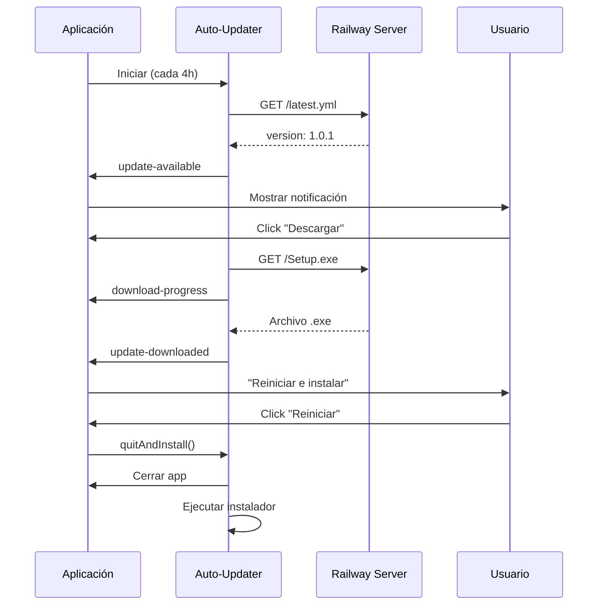

# 📦 Sistema de Instalación y Actualización Automática
**Super Coldy POS - La Gran Michoacana**

Sistema completo de distribución e instalación con actualizaciones automáticas desde Railway.

---

## 🎯 CARACTERÍSTICAS

### ✅ Instalador Profesional
- **Instalador NSIS** para Windows (64-bit)
- Instalación personalizable (directorio, accesos directos)
- Desinstalador integrado
- Icono personalizado
- Instalación por máquina (todos los usuarios)

### ✅ Actualización Automática
- **Verificación automática** cada 4 horas
- **Descarga en segundo plano** sin interrumpir el trabajo
- **Instalación al cerrar** la aplicación
- **Notificaciones visuales** en la interfaz
- **Control manual** desde la UI

---

## 📋 REQUISITOS

### Sistema de Build
- Node.js 18+ instalado
- Cuenta de Railway (para hospedar actualizaciones)
- Windows 10/11 (para builds de Windows)

### Archivos Necesarios
- `public/icon.ico` - Icono de la aplicación (256x256)
- `public/icon.icns` - Icono para macOS (opcional)
- `public/icon.png` - Icono para Linux (opcional)

---

## 🛠️ PROCESO DE BUILD

### 1. **Preparar la Aplicación**

```bash
cd La_-gran_michoacana
npm install
```

### 2. **Construir el Instalador**

```bash
# Build completo (compilar + crear instalador)
npm run build

# Solo Windows
npm run build:win
```

### 3. **Archivos Generados**

Ubicación: `La_-gran_michoacana/release/`

```
release/
├── win-unpacked/           # Aplicación sin empaquetar
├── Super Coldy POS Setup 1.0.0.exe    # Instalador NSIS
├── Super Coldy POS 1.0.0.exe          # Portable
└── latest.yml              # Archivo de metadatos para actualizaciones
```

---

## 🚀 CONFIGURAR SERVIDOR DE ACTUALIZACIONES

### Opción 1: Railway (Recomendado)

#### **Paso 1: Crear Servicio de Archivos Estáticos**

1. Accede a tu proyecto en Railway
2. Crea un nuevo servicio "Empty Service"
3. Nombrar: `supercoldy-updates`

#### **Paso 2: Crear Dockerfile**

Crear `packages/update-server/Dockerfile`:

```dockerfile
FROM nginx:alpine

# Copiar archivos de actualización
COPY releases/ /usr/share/nginx/html/

# Configuración de NGINX para CORS
RUN echo 'server { \
    listen 80; \
    root /usr/share/nginx/html; \
    \
    location / { \
        add_header Access-Control-Allow-Origin *; \
        add_header Access-Control-Allow-Methods "GET, OPTIONS"; \
        add_header Access-Control-Allow-Headers "Content-Type"; \
        autoindex on; \
    } \
}' > /etc/nginx/conf.d/default.conf

EXPOSE 80
```

#### **Paso 3: Estructura de Archivos**

```
packages/update-server/
├── Dockerfile
└── releases/
    ├── Super Coldy POS Setup 1.0.0.exe
    ├── latest.yml
    └── Super Coldy POS 1.0.1.exe  (futuras versiones)
```

#### **Paso 4: Deploy a Railway**

```bash
cd packages/update-server
railway up
```

#### **Paso 5: Configurar Dominio**

1. En Railway, ve a Settings del servicio
2. Generate Domain o agrega dominio custom
3. Ejemplo: `supercoldy-updates.up.railway.app`

### Opción 2: Servidor Local

Para pruebas locales, puedes usar `http-server`:

```bash
npx http-server release/ --cors -p 8080
```

---

## 📝 ACTUALIZAR LA CONFIGURACIÓN

### **package.json**

Reemplaza la URL con tu dominio de Railway:

```json
{
  "build": {
    "publish": {
      "provider": "generic",
      "url": "https://tu-dominio.railway.app/"
    }
  }
}
```

---

## 📤 PUBLICAR ACTUALIZACIÓN

### **Opción A: Build con Publicación Automática**

```bash
# Construir y publicar (requiere configuración previa)
npm run build:publish
```

### **Opción B: Publicación Manual**

1. **Construir la aplicación:**
   ```bash
   npm run build:win
   ```

2. **Copiar archivos al servidor:**
   ```bash
   # Copiar a carpeta del servidor de actualizaciones
   cp release/Super\ Coldy\ POS\ Setup\ 1.0.1.exe packages/update-server/releases/
   cp release/latest.yml packages/update-server/releases/
   ```

3. **Desplegar en Railway:**
   ```bash
   cd packages/update-server
   railway up
   ```

### **Verificar Publicación**

Visita: `https://tu-dominio.railway.app/latest.yml`

Deberías ver algo como:
```yaml
version: 1.0.1
files:
  - url: Super Coldy POS Setup 1.0.1.exe
    sha512: abc123...
    size: 89543211
path: Super Coldy POS Setup 1.0.1.exe
sha512: abc123...
releaseDate: '2026-02-17T10:30:00.000Z'
```

---

## 🔄 FLUJO DE ACTUALIZACIÓN

### **Para el Usuario Final**

1. **Instalación Inicial:**
   - Ejecutar `Super Coldy POS Setup 1.0.0.exe`
   - Seguir asistente de instalación
   - Iniciar aplicación desde acceso directo

2. **Cuando hay actualización:**
   - Notificación automática en la esquina inferior derecha
   - Opciones:
     - "Descargar" → Descarga en segundo plano
     - "Después" → Posponer hasta próxima verificación
   - Una vez descargada:
     - "Reiniciar e instalar" → Cierra e instala inmediatamente
     - "Al cerrar" → Instala al próximo cierre de la app

3. **Verificación Manual:**
   - Botón flotante en esquina inferior derecha
   - Click para verificar actualizaciones
   - Icono de engrane/refresh

### **Flujo Técnico**



---

## 🧪 TESTING

### **Prueba Local**

1. **Ejecutar servidor local:**
   ```bash
   cd release
   npx http-server --cors -p 8080
   ```

2. **Modificar temporalmente package.json:**
   ```json
   {
     "build": {
       "publish": {
         "url": "http://localhost:8080/"
       }
     }
   }
   ```

3. **Build y probar:**
   ```bash
   npm run build:win
   ```

4. **Simular actualización:**
   - Cambiar versión en `package.json` a `1.0.1`
   - Hacer nuevo build
   - Copiar archivos a carpeta `release/`
   - Ejecutar versión antigua
   - Debería detectar actualización

### **Prueba de Servidor Railway**

1. Deploy de versión 1.0.0
2. Instalar en máquina de prueba
3. Cambiar versión a 1.0.1 y deploy
4. Esperar 3 segundos o hacer click en botón de verificación
5. Verificar notificación y descarga

---

## 🔧 TROUBLESHOOTING

### **"No se puede verificar actualizaciones"**

- **Causa**: Servidor no accesible o CORS bloqueado
- **Solución**: 
  - Verificar que Railway esté activo
  - Comprobar configuración CORS en NGINX
  - Ver logs en Electron: `%APPDATA%/Super Coldy POS/logs/main.log`

### **"Actualización descargada pero no se instala"**

- **Causa**: Permisos insuficientes o antivirus
- **Solución**:
  - Ejecutar como administrador
  - Agregar excepción en antivirus
  - Verificar `autoInstallOnAppQuit` en main.ts

### **"Error de firma digital"**

- **Causa**: Instalador no firmado (normal en desarrollo)
- **Solución**: Para producción, firmar con certificado:
  ```json
  {
    "win": {
      "certificateFile": "path/to/cert.pfx",
      "certificatePassword": "password"
    }
  }
  ```

### **Ver Logs**

**Windows:**
```powershell
Get-Content "$env:APPDATA\Super Coldy POS\logs\main.log" -Tail 50
```

**Ubicaciones de logs:**
- Main process: `%APPDATA%/Super Coldy POS/logs/main.log`
- Renderer: DevTools Console (Ctrl+Shift+I)

---

## 📊 VERSIONAMIENTO

### **Estrategia Recomendada**

Usar **Semantic Versioning** (SemVer):
- `MAJOR.MINOR.PATCH`
- Ejemplo: `1.2.3`

```
1.0.0 → Release inicial
1.0.1 → Bug fixes
1.1.0 → Nuevas características
2.0.0 → Cambios que rompen compatibilidad
```

### **Actualizar Versión**

En `package.json`:
```json
{
  "name": "super-coldy-electron",
  "version": "1.0.1",  ← Incrementar aquí
}
```

---

## 🚀 WORKFLOW DE PRODUCCIÓN

### **Checklist antes de Release**

- [ ] Incrementar versión en `package.json`
- [ ] Actualizar `CHANGELOG.md` con cambios
- [ ] Compilar versión de producción: `npm run build:win`
- [ ] Probar instalador en máquina limpia
- [ ] Subir archivos a Railway:
  - `Super Coldy POS Setup X.Y.Z.exe`
  - `latest.yml`
- [ ] Verificar que `latest.yml` es accesible
- [ ] Notificar a usuarios (opcional)

### **Script de Deploy Automatizado**

Crear `scripts/deploy-update.ps1`:

```powershell
# Script para deploy de actualización a Railway

param(
    [Parameter(Mandatory=$true)]
    [string]$Version
)

Write-Host "🚀 Desplegando versión $Version..."

# 1. Actualizar version en package.json
npm version $Version --no-git-tag-version

# 2. Build
Write-Host "📦 Construyendo instalador..."
npm run build:win

# 3. Copiar a servidor
Write-Host "📤 Copiando archivos..."
Copy-Item "release/Super Coldy POS Setup $Version.exe" "../packages/update-server/releases/"
Copy-Item "release/latest.yml" "../packages/update-server/releases/"

# 4. Deploy a Railway
Write-Host "🚂 Desplegando a Railway..."
cd ..\packages\update-server
railway up

Write-Host "✅ Deploy completado!"
Write-Host "Verifica en: https://tu-dominio.railway.app/latest.yml"
```

**Uso:**
```powershell
.\scripts\deploy-update.ps1 -Version "1.0.2"
```

---

## 📱 NOTIFICACIONES AL USUARIO

### **UI Integrada**

El componente `UpdateNotification` muestra:
- ✅ Notificación cuando hay actualización disponible
- 📥 Barra de progreso durante descarga
- 🔄 Botón para instalar después de descargar
- ⚙️ Botón flotante para verificar manualmente

### **Toast Notifications**

El sistema usa **Sonner** para mostrar:
- "Nueva actualización disponible" (azul)
- "Descargando actualización..." (info)
- "Actualización lista" (verde, con botón de reinicio)
- "Sistema actualizado" (verificación manual)
- Errores de conexión (rojo)

---

## 🔐 SEGURIDAD

### **Recomendaciones de Producción**

1. **Firma de Código:**
   ```bash
   # Obtener certificado de firma de código
   # Ejemplo: Sectigo, DigiCert, etc.
   ```

2. **HTTPS Obligatorio:**
   - Railway proporciona HTTPS automáticamente
   - No usar HTTP en producción

3. **Verificación de Integridad:**
   - `latest.yml` incluye SHA512 del instalador
   - electron-updater verifica automáticamente

4. **Permisos de Instalación:**
   - `perMachine: true` requiere admin
   - Instala para todos los usuarios

---

## 📚 RECURSOS

### **Documentación Oficial**
- [electron-builder](https://www.electron.build/)
- [electron-updater](https://www.electron.build/auto-update)
- [Railway Docs](https://docs.railway.app/)

### **Archivos del Proyecto**
- [main.ts](electron/main.ts) - Lógica de actualización
- [preload.ts](electron/preload.ts) - IPC handlers
- [UpdateNotification.tsx](src/components/UpdateNotification.tsx) - UI
- [package.json](package.json) - Configuración de build

---

## ✅ RESUMEN EJECUTIVO

### **Para Desarrolladores:**
1. Incrementar versión en `package.json`
2. `npm run build:win`
3. Subir archivos a Railway
4. Listo ✅

### **Para Usuarios Finales:**
1. Instalar una vez con `.exe`
2. Recibir actualizaciones automáticas
3. Click en "Descargar" cuando haya notificación
4. Click en "Reinstalar" o esperar al cierre
5. Listo ✅

---

**🎉 Sistema de actualización automática configurado y listo para producción!**
